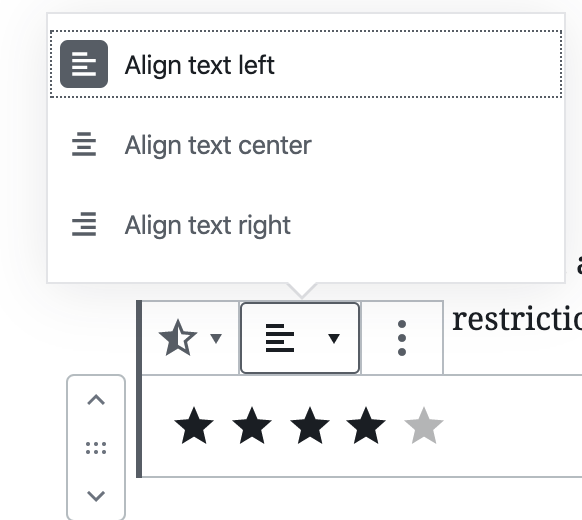

# Mobile Gutenberg (Gutenberg Day edition)

## Getting Started

### Prerequisites

First, make sure you have the following tools installed:

* git
* [nvm](https://github.com/creationix/nvm) (Don't use brew to install nvm)
* Node.js and npm (use nvm to install them)
* yarn (`npm install -g yarn`)

You can use any text editor for this exercise, you don't need to setup a new project on Android Studio or XCode.
However you will need the Android SDK or XCode installed to be able to build.
Pick the platform you are most familiar with, you'll be using it to test on an emulator or a real device.

* Clone the project and submodules:
```
git clone --recurse-submodules --single-branch --branch gutenberg-day-programming-session https://github.com/Tug/gutenberg-mobile.git gutenberg-mobile-programming-session
```

Before running the demo app, you need to download and install the project dependencies. This is done via the following command:

```
cd gutenberg-day-programming-session
# Making sure everyone uses the same node.js version
nvm install
yarn
```

### Start a development environment

We won't be needing the WordPress native app for this session,
the demo app contained within `gutenberg-mobile` will suffice.

Run the development server using the following command:

`yarn start:reset`

Wait until you see the metro screen:
```
┌──────────────────────────────────────────────────────────────────────────────┐
│                                                                              │
│  Running Metro Bundler on port 8081.                                         │
│                                                                              │
│  Keep Metro running while developing on any JS projects. Feel free to        │
│  close this tab and run your own Metro instance if you prefer.               │
│                                                                              │
│  https://github.com/facebook/react-native                                    │
│                                                                              │
└──────────────────────────────────────────────────────────────────────────────┘
```

Open another terminal and run
- `yarn android` for Android

or

- `yarn ios` for iOS


## Exercise Instructions

The goal of this exercise will be to (re-)create the Star Rating block from Jetpack on mobile.
Take some time to familiarize yourself with this block on the web first.
You can see it in action at [Frontendberg](https://frontenberg.tomjn.com/), just click on the
Inserter icon and pick the "Rating Star" block.


Notice the right sidebar and the different settings this block has:


## Open the demo app

Before anything else, please make sure the demo app loads on your device/emulator.

Notice that a "Star Rating" block is already available when you tap on the Inserter ( ⊕ ).
Try to insert this block into the document and notice its current limitation.

Open the [Rating Star block code](./extra-blocks/rating-star/index.js) and
familiarize yourself with the code.

### Step 1 - Load internal modules

Refactor the `edit` and `save` functions into their own module `edit.js` and `save.js`.
Run `yarn lint` to make sure your new modules uses the right syntax. Fix the reported errors if any.

### Step 2 - Replace the star emoji with an SVG icon

A star SVG `icon` is already available in the `rating-star` folder.
Try to replace the emoji in `edit.js` with this icon instead. 
Use it with the `filled` property to display a 3 out of 5 stars rating.

Tips: To lay all the stars horizontally you can wrap them all in a `View` component with the following styles:
```jsx
<View style={ { flex: 1, flexDirection: 'row' } }>
</View>
```

### Step 3 - Adjust the rating by tapping on a star

Now, let's make it listen for touch events and adjust the rating accordingly.

For this, we'll be using the [`TouchableWithoutFeedback`](https://facebook.github.io/react-native/docs/touchablewithoutfeedback)
component from `react-native`. Take a minute to have a look at its documentation.

We'll want to know which star was touched. An easy way to do this is to
wrap each star into its own `TouchableWithoutFeedback` component and handle the
press event with some information about which star was touched.
Your "Touchable Star" component should look something like this:
```jsx
<TouchableWithoutFeedback onPress={ ... }>
    <View>
        <StarIcon .../>
    </View>
</TouchableWithoutFeedback>
```

We need the StarRating component to refresh whenever the rating changes,
for this we'll use `useState` from the `@wordpress/element` package:
```js
/**
 * WordPress dependencies
 */
import { useState } from '@wordpress/element';
```
Take a moment to look at the react documentation on [State Hooks](https://reactjs.org/docs/hooks-overview.html)


### Step 4 - Make it persistent

So far we've used a react state hook to handle state inside our component.
Gutenberg Blocks have their own API to persist state properties, and they are called `attributes`.
Those must be defined inside the block settings.

The Gutenberg API provides those `attributes` as props of our `Edit` and `Save` component,
it also provides some useful functions such as `setAttributes` that allows us to update the attributes.
Using this API we can replace our use of hooks with attributes.

> Add a new `rating` attributes and update our component to use it in place of the `useState` hook.

> Update `save()` to render the correct rating.

Shake your device and select "Show html" to see the resulting template when you update the rating.

### Step 5 - Make the highest rating adjustable

Add a new `maxRating` attribute to our block to handle the maximum number of stars to display.

Update `edit()` and `save()` to take this attribute into account.

Add a settings screen for this block to let users change the value of this attribute from the editor.
Have a look at the implementation of the [Spacer block](https://github.com/WordPress/gutenberg/blob/master/packages/block-library/src/spacer/edit.native.js#L59)
to see how to add a settings bottom sheet with a Slider component in it.


### Step 6 - Align options

The web version supports different options for horizontal alignment:



Add those options to align the stars left, center or right.
You can have a look at the [paragraph block](https://github.com/WordPress/gutenberg/blob/master/packages/block-library/src/paragraph/edit.native.js#L60)
implementation to see how it's done.

> Note: Just like with Paragraph, you will need to have an `align` attribute to persist this setting.

Make sure the right attribute is added to the template when you switch to HTML mode.

### Step 7 (Optional) - Support half star ratings.

Start by supporting floats for `rating`.
The `filled` property of the `StarIcon` component also supports a number between 0 and 1.
Use it to display half a star when the fractional part of the rating is over `0.5`.

Try it by editing the value of the `rating` from the HTML mode and switching back to Visual.

Make it so that pressing the same star a second time shows a half star filled
and update the `rating` attribute to `-0.5`.
Pressing the star a third time should toggle it back to the full star rating.

Update `save()` to use ✨ (the Sparkles emoji) for the 0.5 star.

Highlight the last pressed star just like on the web.
Try using `useState` and `useEffect` to achieve this.

